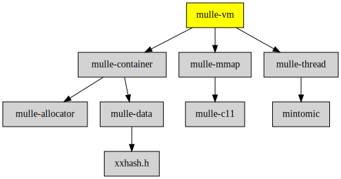

# mulle-vm

#### 🫧 User space virtual memory

A virtual memory system that runs in user space. Its beneficial when you are
writing an editor, which wants to edits huge files, as insertion and deletion
are compartively super-fast. Reading and writing is very much slower though,
but the reasoning is, they are still fast enough for all editor purposes.

It's detrimental in read only situations.

A single instance of mulle_vm is not thread safe, if you need threadsafe
access you need to add locking code. However you can edit separate mulle_vm
instances in different threads, even when they contained shared pages. This is
relevant for copy/paste, where you might have put a "mulle_vm" with copy
contents on a pasteboard and then want to "paste" it into a different
mulle_vm in a different thread.


| Release Version                                       | Release Notes  | AI Documentation
|-------------------------------------------------------|----------------|---------------
|  [](//github.com/mulle-core/mulle-vm/actions) | [RELEASENOTES](RELEASENOTES.md) | [DeepWiki for mulle-vm](https://deepwiki.com/mulle-core/mulle-vm)


### You are here




## Add

**This project is a component of the [mulle-core](//github.com/mulle-core/mulle-core) library. As such you usually will *not* add or install it
individually, unless you specifically do not want to link against
`mulle-core`.**


### Add as an individual component

Use [mulle-sde](//github.com/mulle-sde) to add mulle-vm to your project:

``` sh
mulle-sde add github:mulle-core/mulle-vm
```

To only add the sources of mulle-vm with dependency
sources use [clib](https://github.com/clibs/clib):


``` sh
clib install --out src/mulle-core mulle-core/mulle-vm
```

Add `-isystem src/mulle-core` to your `CFLAGS` and compile all the sources that were downloaded with your project.


## Install

Use [mulle-sde](//github.com/mulle-sde) to build and install mulle-vm and all dependencies:

``` sh
mulle-sde install --prefix /usr/local \
   https://github.com/mulle-core/mulle-vm/archive/latest.tar.gz
```

### Legacy Installation

Install the requirements:

| Requirements                                 | Description
|----------------------------------------------|-----------------------
| [mulle-mmap](https://github.com/mulle-core/mulle-mmap)             | 🇧🇿 Memory mapped file access
| [mulle-container](https://github.com/mulle-c/mulle-container)             | 🛄 Arrays, hashtables and a queue
| [mulle-thread](https://github.com/mulle-concurrent/mulle-thread)             | 🔠 Cross-platform thread/mutex/tss/atomic operations in C

Download the latest [tar](https://github.com/mulle-core/mulle-vm/archive/refs/tags/latest.tar.gz) or [zip](https://github.com/mulle-core/mulle-vm/archive/refs/tags/latest.zip) archive and unpack it.

Install **mulle-vm** into `/usr/local` with [cmake](https://cmake.org):

``` sh
PREFIX_DIR="/usr/local"
cmake -B build                               \
      -DMULLE_SDK_PATH="${PREFIX_DIR}"       \
      -DCMAKE_INSTALL_PREFIX="${PREFIX_DIR}" \
      -DCMAKE_PREFIX_PATH="${PREFIX_DIR}"    \
      -DCMAKE_BUILD_TYPE=Release &&
cmake --build build --config Release &&
cmake --install build --config Release
```


## Author

[Nat!](https://mulle-kybernetik.com/weblog) for Mulle kybernetiK  


